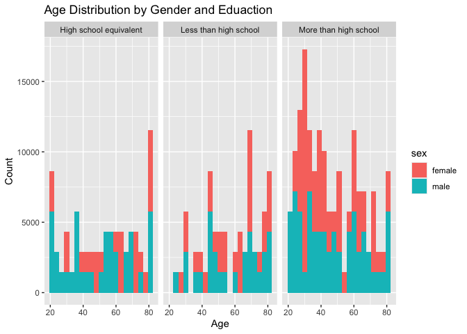
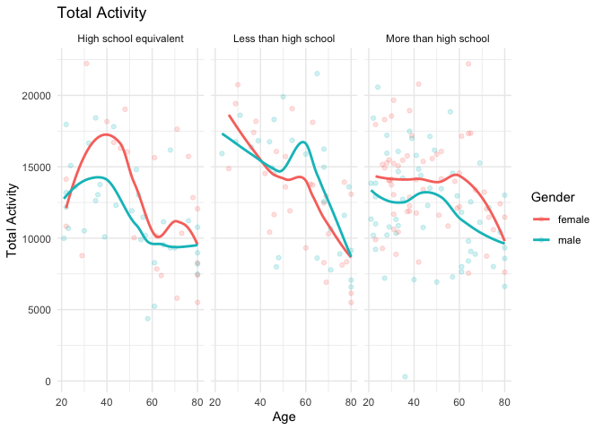

Homework 3
================

``` r
library(tidyverse)
```

    ## ── Attaching core tidyverse packages ──────────────────────── tidyverse 2.0.0 ──
    ## ✔ dplyr     1.1.4     ✔ readr     2.1.5
    ## ✔ forcats   1.0.0     ✔ stringr   1.5.1
    ## ✔ ggplot2   3.5.1     ✔ tibble    3.2.1
    ## ✔ lubridate 1.9.3     ✔ tidyr     1.3.1
    ## ✔ purrr     1.0.2     
    ## ── Conflicts ────────────────────────────────────────── tidyverse_conflicts() ──
    ## ✖ dplyr::filter() masks stats::filter()
    ## ✖ dplyr::lag()    masks stats::lag()
    ## ℹ Use the conflicted package (<http://conflicted.r-lib.org/>) to force all conflicts to become errors

## Problem 1

### Load, tidy, merge, and otherwise organize the data sets. Your final dataset should include all originally observed variables; exclude participants less than 21 years of age, and those with missing demographic data; and encode data with reasonable variable classes (i.e. not numeric, and using factors with the ordering of tables and plots in mind).

Cleaning and combining data sets

``` r
demographic_df = 
  read_csv("datasets/nhanes_covar.csv",na = c("NA",".",""), skip = 4)|>
  janitor::clean_names() |>
  filter(age >= 21)
```

    ## Rows: 250 Columns: 5
    ## ── Column specification ────────────────────────────────────────────────────────
    ## Delimiter: ","
    ## dbl (5): SEQN, sex, age, BMI, education
    ## 
    ## ℹ Use `spec()` to retrieve the full column specification for this data.
    ## ℹ Specify the column types or set `show_col_types = FALSE` to quiet this message.

``` r
accelerometer_df = 
  read_csv("datasets/nhanes_accel.csv",na = c("NA",".",""))|>
  janitor::clean_names() |>
  pivot_longer(
    cols = starts_with("min"),
    names_to = "minute",
    values_to = "activity value"
  )
```

    ## Rows: 250 Columns: 1441
    ## ── Column specification ────────────────────────────────────────────────────────
    ## Delimiter: ","
    ## dbl (1441): SEQN, min1, min2, min3, min4, min5, min6, min7, min8, min9, min1...
    ## 
    ## ℹ Use `spec()` to retrieve the full column specification for this data.
    ## ℹ Specify the column types or set `show_col_types = FALSE` to quiet this message.

``` r
cleaned_df = 
  demographic_df |>
  inner_join(accelerometer_df, by=c("seqn"))|>
  filter(!is.na(sex) & !is.na(bmi) & !is.na(education) & !is.na(age)) |>
  mutate(
    sex = ifelse(sex == 1, "male", "female"),
    education = case_when(
      education == 1 ~ "Less than high school",
      education == 2 ~ "High school equivalent",
      education == 3 ~ "More than high school"
  ))
head(cleaned_df)
```

    ## # A tibble: 6 × 7
    ##    seqn sex     age   bmi education              minute `activity value`
    ##   <dbl> <chr> <dbl> <dbl> <chr>                  <chr>             <dbl>
    ## 1 62161 male     22  23.3 High school equivalent min1              1.11 
    ## 2 62161 male     22  23.3 High school equivalent min2              3.12 
    ## 3 62161 male     22  23.3 High school equivalent min3              1.47 
    ## 4 62161 male     22  23.3 High school equivalent min4              0.938
    ## 5 62161 male     22  23.3 High school equivalent min5              1.60 
    ## 6 62161 male     22  23.3 High school equivalent min6              0.145

### Produce a reader-friendly table for the number of men and women in each education category, and create a visualization of the age distributions for men and women in each education category. Comment on these items.

``` r
sex_edu_table = 
  cleaned_df |>
  group_by(sex,education) |>
  mutate(
    education = as.factor(education),
    sex = as.factor(sex)
  ) |>
  summarise(count = n()) |>
  arrange(sex,education)
```

    ## `summarise()` has grouped output by 'sex'. You can override using the `.groups`
    ## argument.

``` r
print(sex_edu_table)
```

    ## # A tibble: 6 × 3
    ## # Groups:   sex [2]
    ##   sex    education              count
    ##   <fct>  <fct>                  <int>
    ## 1 female High school equivalent 33120
    ## 2 female Less than high school  40320
    ## 3 female More than high school  84960
    ## 4 male   High school equivalent 50400
    ## 5 male   Less than high school  38880
    ## 6 male   More than high school  80640

``` r
age_distribution_plot = 
  cleaned_df |>
  ggplot(aes(x = age, fill = sex)) +
  geom_histogram(binwidth = 3) +
  facet_wrap(~education) +
  labs(title = "Age Distribution by Gender and Eduaction", 
       x = "Age",
       y = "Count")
print(age_distribution_plot)
```

<!-- -->

comment:

### Traditional analyses of accelerometer data focus on the total activity over the day. Using your tidied dataset, aggregate across minutes to create a total activity variable for each participant. Plot these total activities (y-axis) against age (x-axis); your plot should compare men to women and have separate panels for each education level. Include a trend line or a smooth to illustrate differences. Comment on your plot.

``` r
total_activity_df = 
  cleaned_df |>
  group_by(seqn, sex, age, education) |>
  summarise(total_activity = sum(`activity value`, na.rm = TRUE))
```

    ## `summarise()` has grouped output by 'seqn', 'sex', 'age'. You can override
    ## using the `.groups` argument.

``` r
total_activity_df |>
  ggplot(aes(x = age, y = total_activity,color = sex)) +
  geom_point(alpha = .2)+
  geom_smooth(method = "loess", se = FALSE) +
  facet_wrap(~education) +
  labs(title = "Total Activity",
       x = "Age",
       y = "Total Activity",
       color = "Gender") +
  theme_minimal()
```

    ## `geom_smooth()` using formula = 'y ~ x'

<!-- -->
