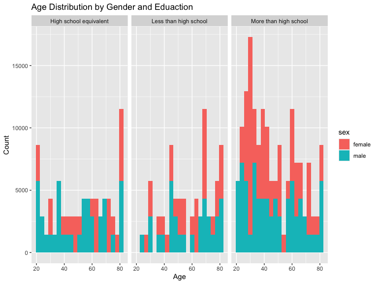
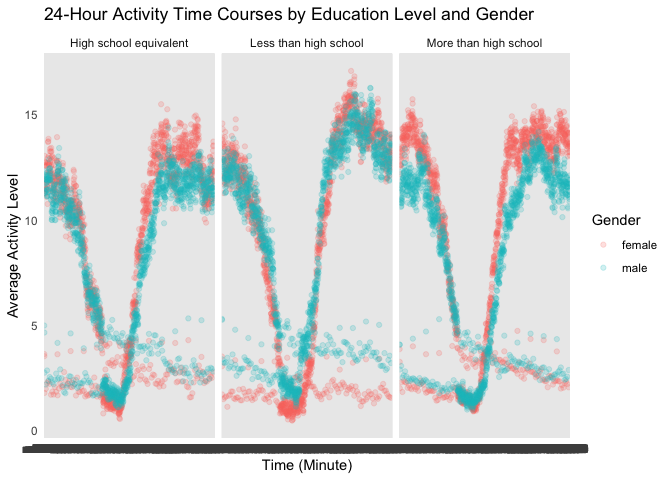
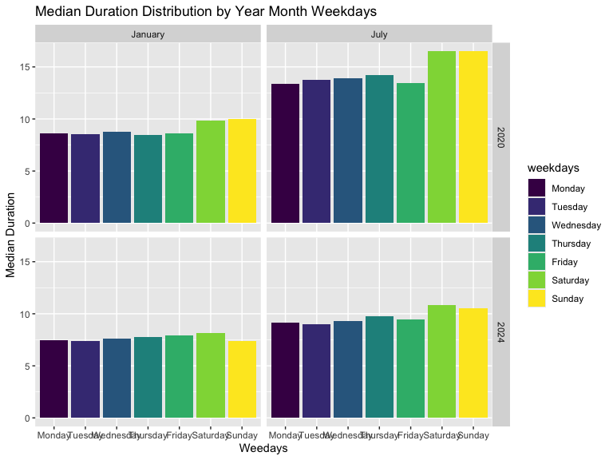

Homework 3
================
Sihan Qiu

``` r
library(tidyverse)
```

    ## ── Attaching core tidyverse packages ──────────────────────── tidyverse 2.0.0 ──
    ## ✔ dplyr     1.1.4     ✔ readr     2.1.5
    ## ✔ forcats   1.0.0     ✔ stringr   1.5.1
    ## ✔ ggplot2   3.5.1     ✔ tibble    3.2.1
    ## ✔ lubridate 1.9.3     ✔ tidyr     1.3.1
    ## ✔ purrr     1.0.2     
    ## ── Conflicts ────────────────────────────────────────── tidyverse_conflicts() ──
    ## ✖ dplyr::filter() masks stats::filter()
    ## ✖ dplyr::lag()    masks stats::lag()
    ## ℹ Use the conflicted package (<http://conflicted.r-lib.org/>) to force all conflicts to become errors

## Problem 1

``` r
library(p8105.datasets)
data("ny_noaa")
```

Description: this data set contains 2595176 observations, and 7
variables. Key variables include station id, data, perception, snowfall,
depth of snow, min and max temperature.

``` r
ny_noaa |>
  count(snow)|>
  arrange(desc(n))
```

    ## # A tibble: 282 × 2
    ##     snow       n
    ##    <int>   <int>
    ##  1     0 2008508
    ##  2    NA  381221
    ##  3    25   31022
    ##  4    13   23095
    ##  5    51   18274
    ##  6    76   10173
    ##  7     8    9962
    ##  8     5    9748
    ##  9    38    9197
    ## 10     3    8790
    ## # ℹ 272 more rows

``` r
ny_noaa = 
  ny_noaa |>
  separate(date, into = c("year", "month", "day"), convert = TRUE)|>
  mutate(
    tmax = as.numeric(tmax),
    tmin = as.numeric(tmin))
```

``` r
january_july_data =
  ny_noaa |>
  filter(month %in% c("01", "07")) |>
  group_by(id, year, month) |>
  summarize(avg_tmax = mean(tmax, na.rm = TRUE)) |>
  ggplot(aes(x = year, y = avg_tmax, group = id, color = id)) +
  geom_line() +
  facet_wrap(~ month, ncol = 1, labeller = labeller(month = c("01" = "January", "07" = "July"))) +
  labs(title = "Average Max Temperature in January and July across Stations",
       x = "Year", y = "Average Max Temperature (°C)")
```

    ## `summarise()` has grouped output by 'id', 'year'. You can override using the
    ## `.groups` argument.

## Problem 2

### Load, tidy, merge, and otherwise organize the data sets. Your final dataset should include all originally observed variables; exclude participants less than 21 years of age, and those with missing demographic data; and encode data with reasonable variable classes (i.e. not numeric, and using factors with the ordering of tables and plots in mind).

Cleaning and combining data sets

``` r
demographic_df = 
  read_csv("datasets/nhanes_covar.csv",na = c("NA",".",""), skip = 4)|>
  janitor::clean_names() |>
  filter(age >= 21)
```

    ## Rows: 250 Columns: 5
    ## ── Column specification ────────────────────────────────────────────────────────
    ## Delimiter: ","
    ## dbl (5): SEQN, sex, age, BMI, education
    ## 
    ## ℹ Use `spec()` to retrieve the full column specification for this data.
    ## ℹ Specify the column types or set `show_col_types = FALSE` to quiet this message.

``` r
accelerometer_df = 
  read_csv("datasets/nhanes_accel.csv",na = c("NA",".",""))|>
  janitor::clean_names() |>
  pivot_longer(
    cols = starts_with("min"),
    names_to = "minute",
    values_to = "activity value"
  )
```

    ## Rows: 250 Columns: 1441
    ## ── Column specification ────────────────────────────────────────────────────────
    ## Delimiter: ","
    ## dbl (1441): SEQN, min1, min2, min3, min4, min5, min6, min7, min8, min9, min1...
    ## 
    ## ℹ Use `spec()` to retrieve the full column specification for this data.
    ## ℹ Specify the column types or set `show_col_types = FALSE` to quiet this message.

``` r
cleaned_df = 
  demographic_df |>
  inner_join(accelerometer_df, by=c("seqn"))|>
  filter(!is.na(sex) & !is.na(bmi) & !is.na(education) & !is.na(age)) |>
  mutate(
    sex = ifelse(sex == 1, "male", "female"),
    education = case_when(
      education == 1 ~ "Less than high school",
      education == 2 ~ "High school equivalent",
      education == 3 ~ "More than high school"
  ))
head(cleaned_df)
```

    ## # A tibble: 6 × 7
    ##    seqn sex     age   bmi education              minute `activity value`
    ##   <dbl> <chr> <dbl> <dbl> <chr>                  <chr>             <dbl>
    ## 1 62161 male     22  23.3 High school equivalent min1              1.11 
    ## 2 62161 male     22  23.3 High school equivalent min2              3.12 
    ## 3 62161 male     22  23.3 High school equivalent min3              1.47 
    ## 4 62161 male     22  23.3 High school equivalent min4              0.938
    ## 5 62161 male     22  23.3 High school equivalent min5              1.60 
    ## 6 62161 male     22  23.3 High school equivalent min6              0.145

### Produce a reader-friendly table for the number of men and women in each education category, and create a visualization of the age distributions for men and women in each education category. Comment on these items.

``` r
cleaned_df |>
  group_by(sex,education) |>
  mutate(
    education = as.factor(education),
    sex = as.factor(sex)
  ) |>
  summarise(count = n()) |>
  arrange(sex,education) |>
 knitr::kable()
```

    ## `summarise()` has grouped output by 'sex'. You can override using the `.groups`
    ## argument.

| sex    | education              | count |
|:-------|:-----------------------|------:|
| female | High school equivalent | 33120 |
| female | Less than high school  | 40320 |
| female | More than high school  | 84960 |
| male   | High school equivalent | 50400 |
| male   | Less than high school  | 38880 |
| male   | More than high school  | 80640 |

Comment: Both females and males have highest counts in more than high
school. there are more females with the education level of less than
high school. It may indicate a stereotype within gender.

``` r
age_distribution_plot = 
  cleaned_df |>
  ggplot(aes(x = age, fill = sex)) +
  geom_histogram(binwidth = 3) +
  facet_wrap(~education) +
  labs(title = "Age Distribution by Gender and Eduaction", 
       x = "Age",
       y = "Count")
print(age_distribution_plot)
```

<!-- -->
Comment: Traditional analyses of accelerometer data focus on the total
activity over the day. Using your tidied dataset, aggregate across
minutes to create a total activity variable for each participant. Plot
these total activities (y-axis) against age (x-axis); your plot should
compare men to women and have separate panels for each education level.
Include a trend line or a smooth to illustrate differences. Comment on
your plot.

``` r
total_activity_df = 
  cleaned_df |>
  group_by(seqn, sex, age, education) |>
  summarise(total_activity = sum(`activity value`, na.rm = TRUE))
```

    ## `summarise()` has grouped output by 'seqn', 'sex', 'age'. You can override
    ## using the `.groups` argument.

``` r
total_activity_df |>
  ggplot(aes(x = age, y = total_activity,color = sex)) +
  geom_point(alpha = .2)+
  geom_smooth(method = "loess", se = FALSE) +
  facet_wrap(~education) +
  labs(title = "Total Activity",
       x = "Age",
       y = "Total Activity",
       color = "Gender") +
  theme_minimal()
```

    ## `geom_smooth()` using formula = 'y ~ x'

<!-- -->

\###Make a three-panel plot that shows the 24-hour activity time courses
for each education level and use color to indicate sex.

``` r
activity_time_df = 
  cleaned_df |>
  group_by(sex,education, minute)|>
  summarise(ave_activity = mean(`activity value`, na.rm = TRUE))
```

    ## `summarise()` has grouped output by 'sex', 'education'. You can override using
    ## the `.groups` argument.

``` r
activity_time_df |>
  ggplot(aes(x = minute, y = ave_activity, color = sex))+
  geom_point(alpha = .2) +
  facet_wrap(~education) + 
  labs(title = "24-Hour Activity Time Courses by Education Level and Gender",
       x = "Time (Minute)",
       y = "Average Activity Level",
       color = "Gender") +
  theme_minimal()
```

<!-- -->

Description: WE can see that there are peaks in all three panels in the
morning and afternoon. It means that people start or end studying at
peak times. People may just get up and go to sleep. the shapes of three
panels are almost same, but seems like people with less than high school
education level tend to study very late. By comparing gender, in all
three panels, females tend to have higher study activity level than
males. It means that females may spend more time on studying.

## Q3

### Read datasets first

``` r
jan_2020_citi_df = 
  read_csv("citibike/Jan 2020 Citi.csv", na = c("NA",".","")) |>
  janitor::clean_names()
```

    ## Rows: 12420 Columns: 7
    ## ── Column specification ────────────────────────────────────────────────────────
    ## Delimiter: ","
    ## chr (6): ride_id, rideable_type, weekdays, start_station_name, end_station_n...
    ## dbl (1): duration
    ## 
    ## ℹ Use `spec()` to retrieve the full column specification for this data.
    ## ℹ Specify the column types or set `show_col_types = FALSE` to quiet this message.

``` r
july_2020_citi_df = 
  read_csv("citibike/July 2020 Citi.csv", na = c("NA",".",""))|>
  janitor::clean_names()
```

    ## Rows: 21048 Columns: 7
    ## ── Column specification ────────────────────────────────────────────────────────
    ## Delimiter: ","
    ## chr (6): ride_id, rideable_type, weekdays, start_station_name, end_station_n...
    ## dbl (1): duration
    ## 
    ## ℹ Use `spec()` to retrieve the full column specification for this data.
    ## ℹ Specify the column types or set `show_col_types = FALSE` to quiet this message.

``` r
jan_2024_citi_df = 
  read_csv("citibike/Jan 2024 Citi.csv", na=c("NA",".",""))|>
  janitor::clean_names()
```

    ## Rows: 18861 Columns: 7
    ## ── Column specification ────────────────────────────────────────────────────────
    ## Delimiter: ","
    ## chr (6): ride_id, rideable_type, weekdays, start_station_name, end_station_n...
    ## dbl (1): duration
    ## 
    ## ℹ Use `spec()` to retrieve the full column specification for this data.
    ## ℹ Specify the column types or set `show_col_types = FALSE` to quiet this message.

``` r
july_2024_citi_df = 
  read_csv("citibike/July 2024 Citi.csv",na=c("NA",".",""))|>
  janitor::clean_names()
```

    ## Rows: 47156 Columns: 7
    ## ── Column specification ────────────────────────────────────────────────────────
    ## Delimiter: ","
    ## chr (6): ride_id, rideable_type, weekdays, start_station_name, end_station_n...
    ## dbl (1): duration
    ## 
    ## ℹ Use `spec()` to retrieve the full column specification for this data.
    ## ℹ Specify the column types or set `show_col_types = FALSE` to quiet this message.

``` r
jan_2020_citi_df =
  jan_2020_citi_df |>
  mutate(year = 2020, month = "January")

july_2020_citi_df = 
  july_2020_citi_df |>
  mutate(year = 2020, month = "July")

jan_2024_citi_df = 
  jan_2024_citi_df |>
  mutate(year = 2024, month = "January")

july_2024_citi_df = 
  july_2024_citi_df |>
  mutate(year = 2024, month = "July")
```

``` r
citi_all_df = 
  bind_rows(jan_2020_citi_df,july_2020_citi_df,jan_2024_citi_df,july_2024_citi_df) |>
  filter(!is.na(start_station_name)&!is.na(end_station_name)) |>
  mutate(weekdays = factor(weekdays, 
                           levels = c(
                            "Monday", 
                            "Tuesday", 
                            "Wednesday", 
                            "Thursday", 
                            "Friday", 
                            "Saturday", 
                            "Sunday"),
                           ordered = TRUE)) |>
  arrange(weekdays)
```

Description: the tidy citi data set includes 99253 observations, and 9
variables. Key variables includes riders’ id, bike’s type, the day they
used, duration, the start station’s name and end stattion’s name, as
well as whether they are member of citi. I combined four individual data
sets by users’ id, and remove all missing data in start station and end
station. I also re-arrange the weekdays variable, by preseting from
Monday to Sunday.

### Produce a reader-friendly table showing the total number of rides in each combination of year and month separating casual riders and Citi Bike members. Comment on these results.

``` r
ride_summary = 
  citi_all_df |>
  group_by(year, month,member_casual)|>
  summarise(total_rides = n())
```

    ## `summarise()` has grouped output by 'year', 'month'. You can override using the
    ## `.groups` argument.

Description: the reader-friendly table includes 8 observations, and 4
variables. We can see that there were more members using citi than
casual users in 2020 Jan to 2024 Jan. The total use of causal and member
in 2024 July both increased a lot. We can see an increased demand on
citi in NYC.

### Make a table showing the 5 most popular starting stations for July 2024; include the number of rides originating from these stations.

``` r
top_station =
  july_2024_citi_df |>
  group_by(start_station_name)|>
  summarise(total_rides = n()) |>
  arrange(desc(total_rides))|>
  slice(1:5)
```

\###Make a plot to investigate the effects of day of the week, month,
and year on median ride duration. This plot can include one or more
panels, but should facilitate comparison across all variables of
interest. Comment on your observations from this plot.

``` r
median_duration = 
  citi_all_df |>
  group_by(year, month, weekdays)|>
  summarise(median_duration = median(duration)) 
```

    ## `summarise()` has grouped output by 'year', 'month'. You can override using the
    ## `.groups` argument.

``` r
  ggplot(median_duration, aes(x = weekdays, y = median_duration, fill = weekdays))+
  geom_col(position = "dodge") +
    facet_grid(year~month) +
    labs(title = "Median Duration Distribution by Year Month Weekdays",
         x = "Weedays",
         y = "Median Duration")
```

<!-- -->
Comments: In both 2020 and 2024, rides in July generally have longer
median durations compared to January. This may relate to weather. July
is warmer than January. In July 2020, there is an increase ride duration
on weekends. People have more leisure time to use citi bike. In July
2020, the duration is higher than other three months.

\###There were relatively few electric Citi Bikes in 2020, but many more
are available now. For data in 2024, make a figure that shows the impact
of month, membership status, and bike type on the distribution of ride
duration. Comment on your results.

``` r
ride_2024 =
  bind_rows(jan_2024_citi_df, july_2024_citi_df) |>
  ggplot(aes(x = rideable_type, y = duration, fill = member_casual))+
  geom_violin(scale = "width") +
  facet_grid(month ~ member_casual) +  
  labs(title = "Distribution of Ride Duration by Bike Type, Month, and Membership Status (2024)",
       x = "Bike Type",
       y = "Ride Duration",
       fill = "Membership Status")
ride_2024
```

<!-- -->
Comment: We can see that casual riders tend to have longer duration than
member riders because the spread looks wider than member riders. Classic
bikes tend to have wider spread in casual riders, but same spread in
member riders. In January, the use of classic bike is higher than
electric bike both for casual riders and member rider. However, the use
of two bikes are almost same in July.
